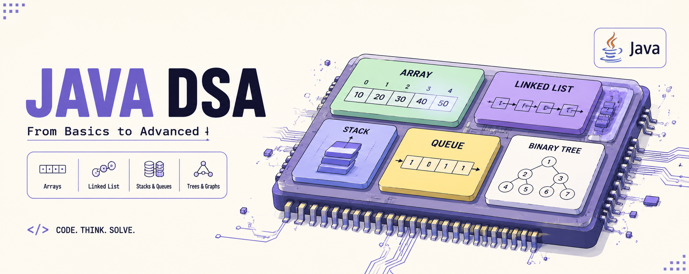

# Code DSA

<p align="center">
	
</p>

<p align="center">
	
	
	
</p>

This repository is a clean Java-based DSA practice workspace. Each file is self-contained, making it easy to study one topic at a time, experiment with implementations, and run examples independently.

## What's Inside

- Core fundamentals: counting digits, gcd, reversing numbers, recursion, hashing, and sorting.
- Search patterns: binary search, bounds, rotated arrays, peak finding, and related variations.
- Trees and graph-style thinking: binary trees, binary search trees, and traversal practice.
- Technique drills: bit manipulation, greedy, sliding window, two pointers, stacks, queues, tries, patterns, and recursion.

## File Guide

- [array.java](array.java) - array fundamentals and common practice problems.
- [basic.java](basic.java) - core fundamentals and starter DSA routines.
- [binarysearch.java](binarysearch.java) - binary search patterns and variations.
- [binary_trees.java](binary_trees.java) - binary tree traversal and problems.
- [binary_serach_tree.java](binary_serach_tree.java) - binary search tree operations and practice.
- [bit_manipulation.java](bit_manipulation.java) - bitwise techniques and common problems.
- [dp.java](dp.java) - dynamic programming concepts, states, and optimization patterns.
- [graph.java](graph.java) - graph traversal, shortest paths, and connectivity problems.
- [greedy.java](greedy.java) - greedy strategy problems.
- [heap.java](heap.java) - priority queue and heap-based problems.
- [linked_list.java](linked_list.java) - linked list operations and pointer-based practice.
- [pattern.java](pattern.java) - pattern printing exercises.
- [recursion.java](recursion.java) - recursion and backtracking-style drills.
- [sliding_window_2_pointer.java](sliding_window_2_pointer.java) - sliding window and two-pointer techniques.
- [stacks_queue.java](stacks_queue.java) - stack and queue based problems.
- [strings.java](strings.java) - string manipulation, parsing, and matching practice.
- [trie.java](trie.java) - trie data structure examples.

## Quick Start

Compile and run any file directly with `javac` and `java`:

```bash
javac basic.java
java basic
```

Use the class name that matches the file you are running. Most files are independent practice modules, so you can work through them one at a time.

## Project Notes

- The workspace is organized as a study notebook rather than a single application.
- File names stay close to the DSA topic they cover, so you can jump to the area you want quickly.
- The banner is a local PNG asset, so the README stays portable and does not depend on external images.